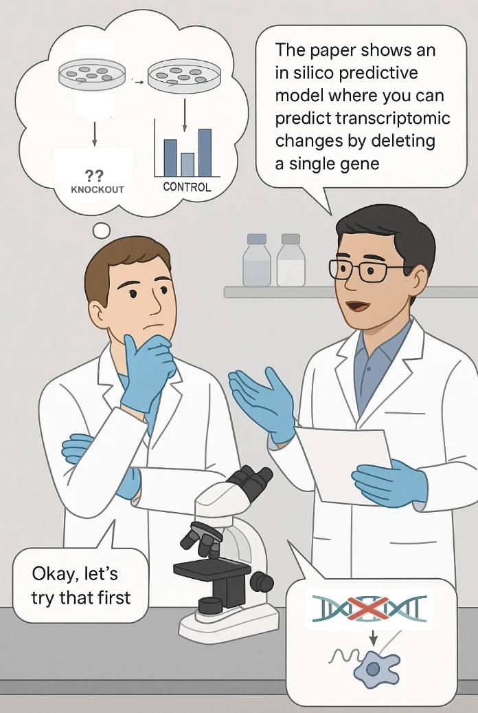
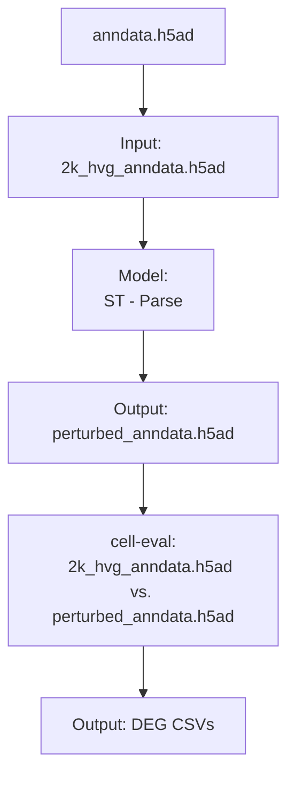

## Present State

We came across this [paper](https://www.biorxiv.org/content/10.1101/2025.06.26.661135v2) at work, which is trying to model cellular behaviour upon perturbation of a gene using deep learning. The aim is to predict the whole transcriptome of cells given a gene perturbation (well...technically it tries to predict change in transcriptome upon gene perturbation). 

## Promise of virtual cell for perturbation modelling

There are few challenges in the wet-lab for perturbation:

- Cost
- High technical training
- Scaling across biological contexts (as mentioned by the STATE paper)

Transformer based deep learning models, trained on huge amounts of transcriptomic data (across cell types), have been built attempting to address these challenges in a _in silico_.

Now, how accurate those predictions are and what can be done to improve the method is yet to be seen. The Arc Institute has come up with [Virtual Cell Challenge](https://virtualcellchallenge.org/), inviting researchers to compete in building better pertubation prediction models. STATE and cell-eval are tools that folks at Arc Institute provide for this task.   

We tried to understand and run the model from an end-user's perspective, while breaking our head on the the keyboard. Here is a simplified workflow (using an example dataset from the authors):

## Resources we used

- https://lightning.ai/ (for ⚡️ computation)
- https://huggingface.co/arcinstitute/ST-Parse 
- https://pypi.org/project/arc-state/
- https://colab.research.google.com/drive/1nvufZJS7BcOWt4f-mWSOa77ziZgSZ2wy
- https://x.com/pdhsu/status/1937204236821102854/ (thread by one of the authors on STATE)
- https://arcinstitute.org/news/virtual-cell-model-state

## Notes for future self 

- Genelist?
- Perform the same experiment against a wetlab reported KO experiment
- Clean up the code and make a NB
- [Baseline paper](https://www.nature.com/articles/s41592-025-02772-6), linear model comparison - commentary - must make our contribution - check if STATE does not use Replogle??

